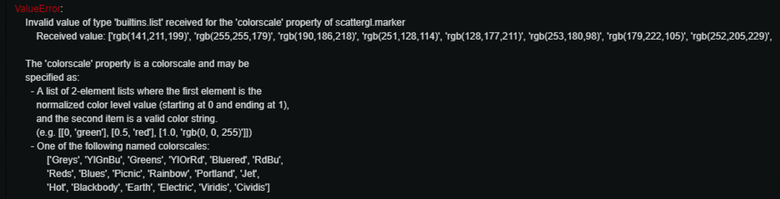

# Convert colorlover colorscale to plotly.py's colorscale
While I was searching for good visualization tool for my research, I found pretty cool tool, [plotly](https://plot.ly/). There are many benefits to use plotly as a visualization tool, but out of all, [scattergl()](https://plot.ly/python/webgl-vs-svg/) function was best feature since I wanted to plot half a million points. plotly enabled me to easily plot diagrams with variety of options including line width, dot size, color selection, etc. In this article, I'll share my small snippet that gives more freedom to color selection in plotly.py's color selection feature. 

## Colorscale in plotly.py
plotly.py is the library to use plot.ly's functions through python. It'll help users to visualize their research results. When using plotly.py, users don't have to manually select colors of individual dots, instead they can just select colorscale to make plotly to automatically assigns colors according to variables. It is well documented [here](https://plot.ly/python/colorscales/). Let me show you how powerful this is by modified example from [WebGL document](https://plot.ly/python/webgl-vs-svg/). Introduced code in this article will use offline mode of plotly.

``` python
import plotly.graph_objs as go
from plotly.offline import download_plotlyjs, init_notebook_mode, plot, iplot

import numpy as np
N = 10000
cluster_id = [np.random.randint(N/1000) for val in range(N)]
trace = go.Scattergl(
    x = np.random.randn(N),
    y = np.random.randn(N),
    mode = 'markers',
    marker = dict(
        colorscale='Rainbow',
        color=cluster_id,
        line = dict(
            width = 1,
            color = '#404040')
    )
)
data = [trace]
iplot(data, filename='WebGL100000')
```

https://plot.ly/~shunkin/2/

Coloscale is awesome, but scales you can chose from is limited to list below.
```
[‘Blackbody’,
‘Bluered’,
‘Blues’,
‘Earth’,
‘Electric’,
‘Greens’,
‘Greys’,
‘Hot’,
‘Jet’,
‘Picnic’,
‘Portland’,
‘Rainbow’,
‘RdBu’,
‘Reds’,
‘Viridis’,
‘YlGnBu’,
‘YlOrRd’]
```

## Using colorlover to improve color selection
As mentioned in [the document](https://plot.ly/pandas/colorlover/), there's an another awesome project called [colorlover](https://github.com/jackparmer/colorlover), that helps us to use broader variety of colorscales. So, after reading the doc, I expected the below code to plot with the colorscale `Set3`. 

``` python
import plotly.graph_objs as go
from plotly.offline import download_plotlyjs, init_notebook_mode, plot, iplot

import numpy as np
import colorlover as cl

# %%
N = 10000
cluster_id = [np.random.randint(N/1000) for val in range(N)]
trace = go.Scattergl(
    x = np.random.randn(N),
    y = np.random.randn(N),
    mode = 'markers',
    marker = dict(
        colorscale=cl.scales['12']['qual']['Set3'],
        color=cluster_id,
        line = dict(
            width = 1,
            color = '#404040')
    )
)
data = [trace]
iplot(data, filename='WebGL100000')
```

## Problem...
Contrary to my expectation, error below had occurred.



From the error, I've noticed the format of colorscale given from `cl.scales` and its of expected colorscales are different. 

## Small snippet to solve the problem 
I strongly wanted to use `Set3` colorscale. To solve the problem, I wrote short function to convert color scale format from `cl.scales` to plotly.py compatible format. It's dead simple.
``` python
import numpy as np
import colorlover as cl

def convert_colorscale_format(colorscale):
    plotly_colorscale = []
    for index, sec_value in enumerate(np.linspace(0, 1, len(colorscale))):
        plotly_colorscale.append([sec_value, colorscale[index]])
    return plotly_colorscale
```

After introducing the function, sample code will be like below.
``` python
import plotly.graph_objs as go
from plotly.offline import download_plotlyjs, init_notebook_mode, plot, iplot

import numpy as np
import colorlover as cl

def convert_colorscale_format(colorscale):
    plotly_colorscale = []
    for index, sec_value in enumerate(np.linspace(0, 1, len(colorscale))):
        plotly_colorscale.append([sec_value, colorscale[index]])
    return plotly_colorscale

# %%
N = 10000
cluster_id = [np.random.randint(N/1000) for val in range(N)]
trace = go.Scattergl(
    x = np.random.randn(N),
    y = np.random.randn(N),
    mode = 'markers',
    marker = dict(
        colorscale=convert_colorscale_format(cl.scales['12']['qual']['Set3']),
        color=cluster_id,
        line = dict(
            width = 1,
            color = '#404040')
    )
)
data = [trace]
iplot(data, filename='WebGL100000')
```

https://plot.ly/~shunkin/4/


Yay, tons of Dippin' Dots!!! Now we can use any colorscales from `colorlover`.
Hope this article helps someone.


References:   
https://github.com/plotly/plotly.py

https://github.com/jackparmer/colorlover

---

Postscript: 
If you know anything about managing multilingual publications in Medium, please let me know in the comment.


